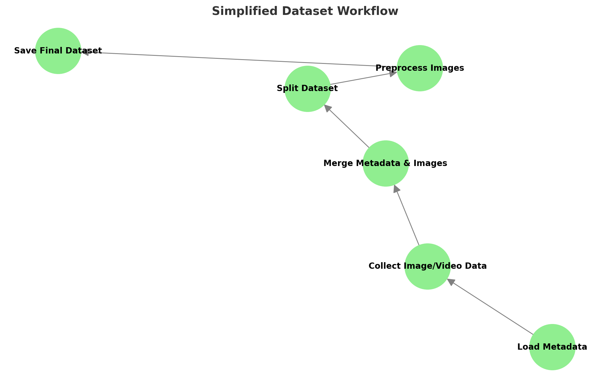

# Multimodal-Colorectal-Polyp-Evolution
AI-Enhanced Predictive Model for Longitudinal Evolution and Malignancy Potential of Colorectal Polyps 

---

## **Table of Contents**
1. [Abstract](#abstract)
2. [Project Objectives](#project-objectives)
3. [Dataset Description](#dataset-description)
4. [Dataset Preprocessing](#dataset-preprocessing)
5. [Implementation Approach](#implementation-approach)
   - [Multimodal AI Framework](#multimodal-ai-framework)
   - [Fusion Model](#fusion-model)
3. [Process and Results](#process-and-results)
   - [Objective 1: Evolutionary Prediction of Polyp Characteristics](#objective-1-evolutionary-prediction-of-polyp-characteristics)
   - [Objective 2: Malignancy Transformation Probability](#objective-2-malignancy-transformation-probability)
   - [Objective 3: Personalized Surveillance Planning](#objective-3-personalized-surveillance-planning)
4. [Summary of Achievements](#summary-of-achievements)
5. [License](#license)

---
## **Abstract**
Polyp evolution and malignancy prediction are pivotal in clinical gastroenterology, focusing on early detection and tailored management of high-risk cases. Traditional approaches often overlook temporal dynamics and multimodal data integration, limiting their predictive accuracy and clinical utility. This study presents a novel machine learning framework for predicting polyp evolution and malignancy risk, equipping clinicians with actionable insights. By combining longitudinal data simulation, advanced imaging feature extraction, and metadata integration, the framework enhances surveillance and early intervention strategies.

---

## **Project Objectives**
1. **Evolutionary Prediction of Polyp Characteristics**:
   - Predict changes in polyp size and morphology over time to track progression toward higher-risk states like adenocarcinoma.
   
2. **Malignancy Transformation Probability**:
   - Develop a risk model to estimate the likelihood of polyps transitioning from benign to malignant states using baseline characteristics and patient demographics.

3. **Personalized Surveillance Planning**:
   - Provide individualized recommendations for follow-up, ensuring clinicians can focus on high-risk cases while optimizing resource allocation.
---

## **Dataset Description**
The ERCPMP-v5 dataset contains detailed endoscopic images, videos, and patient data focused on the morphology and pathology of colorectal polyps. Key details:

- **Patients**: Data from 217 patients.
- **Images & Videos**: 430+ anonymized images and videos.
- **Demographic Data**: Includes patient demographics.
- **Morphological Data**: Classifications based on Paris, Pit, and JNET Classification systems.
- **Pathological Data**: Includes diagnoses like Tubular, Villous, Tubulovillous, Hyperplastic, and more.

  ### **Dataset Link**
[Access the ERCPMP-v5 dataset here](https://data.mendeley.com/datasets/7grhw5tv7n/6/files/72cc0287-84ad-4ade-ae74-8e1e8b30c0a4)

### Contributors
Prepared by experts in Gastroenterology, Hematology, Oncology, and Artificial Intelligence.

---

## **Dataset Preprocessing**
1. **Metadata Preprocessing**: Patinet_ID is the Unique identifier for each patient with morphological and pathological details.
    - Scaled numerical features (e.g., age, polyp size).
    - One-hot encoded categorical features (e.g., dysplasia grade, morphology classification).
2. **Image and Video PreProcessing**:
    - Images and videos are processed to ensure that they are correctly associated with the corresponding Patient_ID.
    - Frames extracted at 2 FPS, resized to 224x224 pixels, and normalized to [0, 1].
4. **Data Merging**:
   - Using Patient_ID as a key, image paths are merged with the metadata.
   - This links each image/frame with the corresponding demographic, morphological, and pathological details.
6. **Splitting the Dataset**:
   - Training Set (60%)
   - Validation Set (20%)
   - Test Set (20%)
7. **Final Dataset Creation**: The final dataset includes:
	- Metadata: Patient and polyp-specific information (size, morphology, diagnosis, etc.).
	- Image Paths: Linking images/frames to patient metadata.
	- Split Information: Indicates whether an entry belongs to training, validation, or test sets.

---

## **Implementation Approach**
### **Multimodal AI Framework**
The Multimodal AI refers to an approach that combines and processes multiple types of data (here text metadata and image data) together to make predictions or provide insights. In this project, Multimodal AI is used to combine:
1. Metadata: Information about the patient (like age, sex) and polyp characteristics (like size, location, and dysplasia grade).
2. Image Features: Detailed information extracted from colonoscopy images or video frames.

By integrating these two types of data, the system creates a more comprehensive understanding of the patient's condition, which helps make better predictions about polyp recurrence and provides tailored surveillance recommendations.

### **Fusion Model**
Fusion Model:
A Fusion Model is a deep learning approach that combines information from multiple sources (or modalities) to make predictions. In this project, it combines:
1. Metadata Features: Information like patient demographics (e.g., age, sex) and polyp characteristics (e.g., size, location, dysplasia grade).
2. Image Features: Detailed visual information extracted from colonoscopy frames using a pre-trained model like Vision Transformer (ViT).

Why Use a Fusion Model?
Multimodal Learning: A fusion model integrates multiple or diverse data types, combining metadata for contextual information (e.g., patient history) with images that capture detailed visual characteristics of polyps. In simple terms, a Fusion Model is like combining two experts—one analyzing patient details and the other examining polyp images—to make the best possible prediction about recurrence risk and follow-up care.

---

## **Dataset Workflow**

---

## **Process and Results**

### **Objective 1: Evolutionary Prediction of Polyp Characteristics**

#### Approach
- Created a simulated longitudinal dataset representing changes over 30 months at six-month intervals.
- Developed two models:
  1. **LSTM-Based Regression Model**: Predicts polyp size at each time step.
  2. **Transformer-Based Classifier**: Predicts transitions in polyp morphology.

#### Key Results
- **Polyp Size Prediction**: Achieved a Mean Absolute Error (MAE) of **0.0689**.
- **Morphology Prediction**: Achieved **85% accuracy**, capturing transitions such as Tubular (low-risk) to Villous or Adenocarcinoma (high-risk).
- **Example Clinical Statements**:
	1.	Month 6: "Polyp size is predicted to be 0.09 cm with a tubular morphology, indicating low risk. Routine monitoring is advised."
	2.	Month 12: "Polyp size increases to 0.12 cm, maintaining tubular morphology. Risk remains low, requiring no immediate intervention."
	3.	Month 18: "Polyp size increases to 0.18 cm, showing early signs of morphological changes. Closer follow-up is recommended."
	4.	Month 24: "Polyp size reaches 0.25 cm, transitioning to Villous morphology. More detailed evaluation is needed."
	5.	Month 30: "Polyp size grows to 0.30 cm with high-risk Villous morphology. Immediate clinical attention is required."
- **Clinical Utility**:
	- Provides actionable insights into polyp progression, with individualized timelines for follow-up:
   		- Stable Polyps: Routine monitoring every 1–3 years.
		- Rapidly Growing Polyps: Frequent monitoring or intervention within 3–6 months.
---

### **Objective 2: Malignancy Transformation Probability**

#### Approach
- Developed a **Fusion Model** combining:
  - Patient metadata (e.g., demographics, clinical context).
  - Image features extracted using **Vision Transformer (ViT)** to capture malignancy indicators.

#### Key Results
- **Accuracy**: Achieved **99.89%** in predicting malignancy potential and recurrence risk.
- **Risk Categories**:
  - **Low Risk**: Polyp shows minimal progression; follow-up recommended in 1–3 years.
  - **Moderate Risk**: Likelihood of recurrence; follow-up advised within 6–12 months.
  - **High Risk**: Significant malignancy potential; immediate follow-up required within 3–6 months.
 - **Outputs:**
	- Risk Stratification: Classifies polyps as "Not Likely to Recur" or "Likely to Recur."
   - Malignancy Likelihood:
	   - Low: Probability < 20%.
	   - Moderate: Probability 20%–50%.
	   - High: Probability > 50%.
- **Example Predictions**:
	- 1.	Sample 1: "Probability = 0.0002; Risk Category = Low Risk; Likelihood of Malignancy = Low."
	- 2.	Sample 5: "Probability = 1.0000; Risk Category = High Risk; Likelihood of Malignancy = High."

---

### **Objective 3: Personalized Surveillance Planning**

#### Approach
- Combined model outputs (size, morphology, malignancy likelihood) to generate follow-up plans.
- Integrated personalized surveillance timelines:
  - **Low Risk**: Routine check-ups every 1–3 years.
  - **Moderate Risk**: Follow-up every 6–12 months.
  - **High Risk**: Immediate evaluation within 3–6 months.

#### Key Results
- Streamlined clinical decision-making by prioritizing high-risk cases.
- Optimized allocation of surveillance resources, reducing unnecessary interventions.

---

## **Summary of Achievements**
1. **Predictive Accuracy**:
   - **Polyp Size Prediction**: MAE of **0.0689**.
   - **Morphology Prediction**: **85% accuracy**.
   - **Malignancy Prediction**: **98.89% accuracy**.

2. **Clinical Impact**:
   - Facilitates longitudinal tracking of polyp evolution, enhancing early detection.
   - Provides granular risk stratifications for malignancy potential, aiding personalized interventions.

3. **Utility**:
   - Empowers clinicians with actionable predictions and follow-up recommendations, improving patient outcomes while optimizing resources.

---

## **License**

The dataset used in this project is licensed under the Attribution 4.0 International (CC BY 4.0). For more details, visit the [Creative Commons License](https://creativecommons.org/licenses/by/4.0/).

